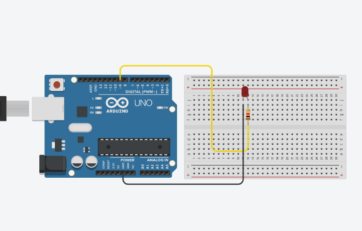

# Not-So-Basic-Arduino

### Table of Contents
* [HelloFunctions](#HelloFunctions)
* [LEDBlinkRevisited](#LEDBlinkRevisited)

## HelloFunctions

### Description
This assignment served as an introduction both to functions and the online Arduino editor that we're using for this year. The idea was to create a sketch with functions that would make a servo spin based on the distance from something that an ultrasonic sensor detected. Using functions to get the distance found by the sensor and to determine the speed of the servo, the code in the void loop section is greatly reduced; in fact, mine is six lines long. Most of the coding is concentrated in the make up of the functions.

### Image

### Code
[Link to sketch](https://create.arduino.cc/editor/lgray52/ab9d6be7-250d-41d2-9c5f-ef9b109d3b19/preview)

### Reflection
This assignment was fairly challenging - my arduino skills were definitely rusty, and of course, I had to look several things up, like how to set up the ultrasonic sensor. The use of functions was a little bit confusing at first, but after re-reading the assignment a couple of times, looking up a couple things, and forming my first getDistance() function, it definitely got easier. I can see how they could be extremely useful in consolodating and cleaning up code. I didn't realise the servo was continuous at first, so I had to adjust my code, but other than that, there weren't too many surprises or difficulties that I can think of with the coding. The wiring was fairly straightforward - I connected the trigger pin of my ultrasonic sensor to digital pin 9 and my echo pin to 10, and my servo to pin 7, and the rest of the wiring from there was just attachments to ground and 5V.

## LEDBlinkRevisited

### Description
The idea of this assignment was to make a led blink, just a little bit more complicated. Using PWM pins and the "analogWrite" command, the point was to make an led fade in and out. Pretty simple, but a little bit tricky to figure out. For extra spice, an ectra challenge was to make a wave that reflected the brightness of the led in the serial monitor with dashes.

### Images

### Code
[Link](https://create.arduino.cc/editor/lgray52/ae4aeb24-d5ce-494d-bbc1-d7caed13f2ca/preview)

### Reflection
This was an interesting assignment. After looking up (and figuring out) the "analogWrite" function, this project was pretty much all downhill, until it came to the wave in the Serial monitor challenge. I tried different combinations of using "analogRead" and trying to do it based on the brightness, but I couldn't get it to work. Mr. Dierolf helped out with this in class - this is where the "for" loop comes in. A "for" loop runs something repeatedly, based on it's instructions, which were determined by math in the case of this project. It seems honestly very useful. 
